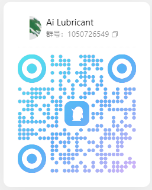

# Ai Lubricant

**一个平台，串起 AI 的全套生态。**

Ai Lubricant 是面向团队与个人的 AI 开发平台。模型中转、Agent、编辑器接入、代码 review、远程节点、内网穿透、浏览器控制、手机控制、手机客户端、邮件与安全把控——全部内置、互相咬合、统一治理。不是工具拼盘，是一套能直接跑生产的完整生态，并提供 OpenAI / Anthropic 兼容接口。

## 核心能力

- **统一模型网关**：多渠道、多账号统一接入，渠道智能选路、九种冻结模式、双层限流重试、用量归一；支持网络代理、URL 前缀代理、直连和节点出口四种模式；免费模型监控与模型列表自动更新；自定义代码渠道。
- **Agent**：主/子 Agent 派发、定时任务；终端、浏览器、网页内、邮箱四种载体；记忆增强；资源显式授权。Agent 能力随数据服务运行，不需要额外的 Agent 进程。
- **连接编辑器**：Claude Code / Codex / OpenCode / Cursor / Gemini CLI 接入；多环境选择（分支模式）；代码 review（PR 自动审查）；多 task 隔离；项目/任务/Git identity。
- **远程节点**：一键脚本连接 Agent；节点主动连接平台，无需公网 IP 和 SSH；支持 execution、management、passive management 三种角色，以及 PTY 终端、主机命令、文件服务和 HTTP 代理出口；节点凭据使用 TOTP 封存 + 审批。
- **内网穿透**：frp / cloudflared / nps 三类方案；隧道方案管理页统一配置；任务预览端口一键对外。
- **浏览器控制**：把你正在用的真实 Chrome 交给 Agent 与编辑器——MV3 扩展接入，提供 CDP 工具集、网页内 Agent 实时对话和任务级会话隔离。
- **手机控制**：装平台 APK 即可控制 Android 真机（不依赖 ADB）：读屏、点击、输入、滚动、打开应用；iOS 走 node-ios 通道。
- **移动端 App**：iOS / Android 客户端支持任务/项目跟踪、手机发起任务、语音转写、图片与 zip 附件，以及 APK 下载升级。
- **邮箱**：邮件读取 MCP，按实例隔离只读，支持真实邮箱与别名标注、正文长度控制、附件默认元数据。
- **MCP、技能与插件生态**：提供 MCP、技能、插件、渠道模板和提示词市场，支持 Git 仓库分发、安装、版本管理和权限治理；资源中心接入 GitHub 著名榜单（Skill / MCP / 提示词 / 插件 / 框架），集中展示、直接搜索，勾选即用于 Agent、任务、编辑器和代码 review。
- **安全治理**：覆盖 API Key 生命周期（真正失效、子 Key 归并、常量时间比较）、MCP 保护（token 绑实例、审批、吊销）、凭据哈希存储、节点 TOTP 封存、审计日志和请求级观测。

## 文档

面向使用者的完整文档站：**https://ai-lubricant.vip100.de5.net/** ，覆盖产品能力、部署、环境变量、节点、移动端、API 和运维说明。


## 架构

主仓库保留 Ai Lubricant 的数据服务、业务层和治理能力；节点、前端和移动端以独立仓库挂载为 submodule：

| 目录 | 作用 | 许可/来源 |
| --- | --- | --- |
| `server/`、`agent/`、`limits/`、`providers/` 等 | 主数据服务、模型聚合、Agent、限流计费和管理 API | 本仓库 BSL 1.1 |
| `node_server/` | 独立节点控制面，接收节点主动连接 | 独立仓库，见其 LICENSE/NOTICE |
| `nodes/` | execution / management 节点客户端与运行时 | 独立仓库，见其 LICENSE/NOTICE |
| `user-frontend/` | 用户门户前端 | 独立仓库，见其 LICENSE/NOTICE |
| `mobile/` | 移动端工程 | 独立仓库，见其 LICENSE/NOTICE |
| `device-control/` | 设备控制 MCP 与移动设备协议实现 | 独立仓库，见其 LICENSE/NOTICE |

## 快速开始

### Docker Compose（推荐）

```bash
# 1. 拉代码（主仓 + 全部子模块，一条命令）
# .gitmodules 使用相对地址，子模块会自动解析到同组织的 ai-lubricant-* 仓库
git clone --recurse-submodules https://github.com/wuxin-gh/ai-lubricant.git
cd ai-lubricant
# 若此前已普通 clone，可补拉子模块：
# git submodule sync --recursive && git submodule update --init --recursive

# 2. 配置环境
cp .env.example .env
# 至少修改：POSTGRES_PASSWORD（强密码）、
# AI_LUBRICANT_COMPAT_ENABLED=true（管理端与用户门户必需）、
# AI_LUBRICANT_BOOTSTRAP_ADMIN_EMAIL / AI_LUBRICANT_BOOTSTRAP_ADMIN_PASSWORD

# 3. 启动（PostgreSQL、Redis 由 Compose 自带，无需单独安装）
docker compose up -d --build

# 4. 初始化数据库（幂等，可重复执行）
docker compose exec ai-lubricant python server/init_db.py
```

启动后访问 `http://127.0.0.1:3006`：用户门户在 `/console`，管理端在 `/manager`。生产环境用 HTTPS 反向代理指向 3006。

服务与端口：

| 端口 | 用途 |
| --- | --- |
| 3006 | Web 入口（数据服务：用户门户 `/console`、管理端 `/manager`） |
| 8003 | 节点控制面（只接受节点连接和内部调用，不要当网页访问） |
| 15432 / 6479 | PostgreSQL / Redis 宿主机调试映射，仅本机调试用；生产建议从对外映射里去掉 |
| 8004 | Tunnel Runtime，仅 Compose 内网可达，不对外发布 |
| 8123 / 9000 | ClickHouse（可选，`--profile clickhouse` 启用） |

数据持久化：PostgreSQL、Redis 与主服务的 Agent 运行时数据（记忆/工作区/SOP/技能归档）、附件、删除前备份、资源镜像、日志、隧道二进制缓存分别落在独立命名卷中，`docker compose down` 保留全部数据；**除非已确认备份完成，否则不要执行 `docker compose down -v`**。备份示例：

```bash
docker compose exec -T postgres pg_dump -U ai_lubricant -d ai-lubricant -Fc > ai-lubricant.dump
```

### 本地运行

需要 Python 3.11、PostgreSQL 16+ 和 Redis 6+：

```bash
cp .env.example .env
pip install -r requirements.txt
python main.py
```

需要节点时，在另一个终端启动节点控制服务：

```bash
python -m node_server
```

需要内网穿透时，再启动 Tunnel Runtime：

```bash
python -m tunnel_server
```

`.env` 只保存连接、密钥和启动级选项；渠道、模型、账号、API Key 等业务数据存储在 PostgreSQL / Redis。`env.ini.example` 仅用于兼容旧部署，新部署优先使用 `.env`。

### 桌面版

Windows 桌面壳的构建入口为：

```powershell
powershell -ExecutionPolicy Bypass -File desktop/build.ps1
```

桌面版与本地服务使用相同的数据服务、节点控制服务和 Tunnel Runtime；构建前需要准备 `user-frontend/dist`。

## API 示例

获取模型列表：

```bash
curl http://localhost:3006/v1/models
```

使用 OpenAI SDK：

```python
from openai import OpenAI

client = OpenAI(
    base_url="http://localhost:3006/v1",
    api_key="your-api-key",
)

response = client.chat.completions.create(
    model="your-model",
    messages=[{"role": "user", "content": "你好"}],
)
print(response.choices[0].message.content)
```

本地直跑（`python main.py`）时端口为 8001。具体的流式响应、错误格式、兼容协议和鉴权方式见 [`docs-site/users-api.html`](docs-site/users-api.html)。

## 社区交流

欢迎加入交流群反馈问题与使用心得。
进群领更多免费资源信息，包括主流国产大模型、内网穿透、域名等等

| 🐧 QQ 交流群 | 💬 微信交流群 |
| :---: | :---: |
|  |  |

## 鸣谢

- [MonkeyCode（chaitin/MonkeyCode）](https://github.com/chaitin/MonkeyCode) —— `monkeycode_compat` 兼容层与用户门户前端的上游基础（AGPL-3.0）。
- [jaychempan/Agent-Leaderboard](https://github.com/jaychempan/Agent-Leaderboard) —— 资源中心接入的 Agent 榜单数据源。
- [hello-generic-agent（datawhalechina）](https://github.com/datawhalechina/hello-generic-agent) —— 本平台 Agent 运行时（GenericAgent）架构的上游参考。

## 发布与许可证

本仓库自研部分采用 **Business Source License 1.1（BSL 1.1）**。在 Change Date 到来前，个人、学习研究、内部评估和非商业使用按 LICENSE 约定进行；商业产品、商业服务、经营性活动或向第三方提供营利服务，需要事先取得著作权人的商业授权。Change Date 和 Change License 以 [`LICENSE`](LICENSE) 为准。

GitHub 发布使用 [`script/publish_github.sh`](script/publish_github.sh) 生成快照。内部开发仓库保留完整历史，公开仓库只接收选定版本的发布快照。

独立 submodule 具有自己的许可证和归属声明，使用或再分发时必须同时遵守各自目录中的 LICENSE、NOTICE 以及上游项目要求。根目录 [`NOTICE`](NOTICE) 记录本仓库与独立组件的来源边界。
