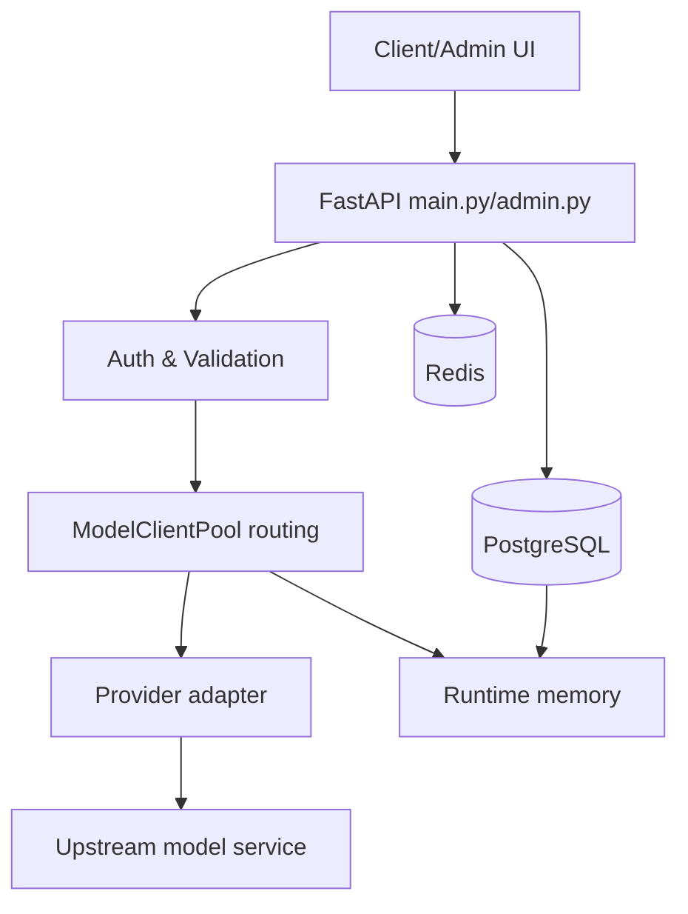

# 架构与数据流整改设计

> 目标：把当前系统的数据来源、运行时关系、接口调用、缓存和整改方向讲清楚。本文不追求“方法名堆砌”，只描述逻辑流、数据关系和应该简化的地方。

## 0. 阅读方式

本文按“页面”组织：

- [整体架构页](#1-整体架构页)
- [数据存放页](#2-数据存放页)
- [缓存页](#3-缓存页)
- [公共 API 页面](#4-公共-api-页面)
- [管理端接口页面](#5-管理端接口页面)
- [核心数据流页面](#6-核心数据流页面)
- [定时任务页面](#7-定时任务页面)
- [复杂逻辑与整改页面](#8-复杂逻辑与整改页面)
- [整改顺序页](#9-整改顺序页)

---

## 1. 整体架构页

### 1.1 总架构图

```text
客户端 / 管理端浏览器
        │
        ▼
FastAPI main.py / admin.py
        │
        ├── 公共 API：/v1/chat/completions / /v1/messages / /v1/responses / /v1/models
        │       │
        │       ▼
        │   请求校验 + API Key 限流 + 模型路由
        │       │
        │       ▼
        │   ModelClientPool
        │       │
        │       ├── provider runtime pool
        │       ├── account runtime state
        │       ├── model -> provider/upstream 关系
        │       └── /v1/models 快照
        │       │
        │       ▼
        │   Provider 适配器
        │       │
        │       ▼
        │   上游模型服务
        │
        └── 管理端 API：/admin/...
                │
                ├── 渠道 / 账号
                ├── provider_models
                ├── 专用线路 model_routes
                ├── 模型组 model_groups
                ├── 模型元数据 model_metadata
                ├── API Key
                ├── 请求日志 / 数据看板
                └── 主配置

存储层
  ├── JSON：只放启动必须配置
  ├── PostgreSQL：业务配置和日志真相源
  ├── Redis：分布式运行态状态 / 短 TTL 缓存
  └── 内存：进程内运行时对象和派生关系
```

### 1.2 Mermaid 源码图

当前网页查看器不会渲染 Mermaid，只会显示源码；这里保留给后续支持。



### 1.3 设计原则

| 原则 | 解释 |
|---|---|
| DB 管事实 | 持久业务数据放 DB，不把 JSON 当运行时真相源 |
| 缓存管关系 | 缓存运行时需要快速访问的关系，不缓存大聚合对象 |
| 查询负责组合 | 管理端页面读取多个数据源后组合展示，不在查询时修复数据 |
| 写入只写当前对象 | 修改线路只改线路；修改模型组只改模型组 |
| 删除实体要清引用 | 删除 provider/account/model 这类被引用实体时，要清理明确引用它的数据 |
| 禁用不是删除 | 禁用只影响运行时选择，不清理配置引用 |
| 简单优先 | 不用并发读掩盖结构问题；优先一次读全数据后内存组合 |

---

## 2. 数据存放页

### 2.1 数据应该放哪里

| 数据 | JSON | PostgreSQL | Redis | 内存 | 说明 |
|---|---:|---:|---:|---:|---|
| Postgres 连接配置 | 是 | 否 | 否 | 启动后可读 | 启动前必须知道 |
| Redis 连接配置 | 是 | 否 | 否 | 启动后可读 | 启动前必须知道 |
| server host/port | 是 | 可选 | 否 | 启动后可读 | 建议保持简单，启动配置放 JSON/env |
| 管理员初始配置 | 可选 | 可选 | session 用 Redis | 内存 session fallback | 当前仍在 main config 中 |
| 渠道 provider | 否 | 是 | 可缓存 | runtime pool | DB 是真相源 |
| 账号 account | 否 | 是 | cooldown/限流 | AccountClient | 账号配置跟 provider 走 DB |
| provider_models | 否 | 是 | 否 | model route map | 上游模型映射真相源 |
| 专用线路 model_routes | 否 | 是 | 否 | route relation | 单条线路 CRUD |
| 模型组 model_groups | 否 | 是 | 否 | group relation | 与线路分开 |
| 模型元数据 | 迁移源 | 是 | 可短 TTL | /v1/models 构建用 | JSON 只做旧数据迁移 |
| API Key | 否 | 是 | 限流状态 | 可建 key index | 密钥配置真相源 DB |
| 限流状态 | 否 | 否 | 是 | fallback | Redis 多进程，内存单进程 fallback |
| 冷却状态 | 否 | 否 | 是 | mirror | Redis 更适合跨进程 |
| 请求日志 | 否 | 是 | 否 | recent log 可内存 | DB 用于查询审计 |
| 操作日志 | 否 | 是 | 否 | 否 | DB 审计 |
| 余额方式 | 否 | 是 | 余额结果缓存 | account 展示快照 | 配置 DB，结果 Redis TTL |

### 2.2 需要从 JSON 清出去的内容

| 内容 | 当前问题 | 整改 |
|---|---|---|
| model_routes/model_groups 旧配置 | 当前删除渠道还在清旧 JSON，真实 DB 没清 | 删除旧清理逻辑，改为 DB 关系清理 |
| mutable main config 的直接 JSON 写 | 绕过 DB/Redis/config store，容易 split-brain | 统一走 CONFIG_STORE |
| provider 运行时配置直接 JSON 兜底 | 多来源判断复杂 | DB 是真相源，JSON 只做 bootstrap/fallback |
| model_metadata.json | 运行期不应参与 | 只保留 DB 为空时迁移 |

---

## 3. 缓存页

### 3.1 缓存总表

| 数据类型 | 缓存读 | 缓存写 | 缓存删除 | 缓存更新 | 数据库添加 | 数据库读取 | 数据库更新 | 数据库删除 | 调用外部逻辑 |
|---|---|---|---|---|---|---|---|---|---|
| provider | 请求调度读 provider pool | 新增渠道创建 pool | 删除渠道移除 pool | 修改/启停更新 pool | provider_configs | provider_configs | provider_configs | provider_configs | 初始化 provider、刷新模型关系 |
| account | 调度读 AccountClient、冷却/限流 | 新增账号加入 pool；冷却写 Redis | 删除账号移除 runtime 和状态 | 修改/启停更新 AccountClient | provider_accounts | provider_accounts | provider_accounts | provider_accounts | 账号认证、余额检测、刷新模型关系 |
| provider_models | 运行时读 model->provider/upstream | refresh 写 `_model_routes/_model_upstream_map` | 删除 provider/映射时移除 | 映射变化后重建 | provider_models | provider_models | provider_models | provider_models | 拉上游模型、刷新 `/v1/models` |
| model_routes | 请求路由读线路关系 | rebuild 写 runtime relation | 删除线路移除 relation | 增删改后重建 | model_routes | model_routes | model_routes | model_routes | 刷新运行时路由、刷新 `/v1/models` |
| model_groups | 请求路由读 group relation | rebuild 写 group relation | 删除组移除 relation | 增删改后重建 | model_groups | model_groups | model_groups | model_groups | 刷新组关系、刷新 `/v1/models` |
| model_metadata | 构建模型快照时读 | 可写 Redis/内存短缓存 | 删除/修改时失效 | 元数据变化重建 `_models` | model_metadata | model_metadata | model_metadata | model_metadata | OpenRouter/models.dev 导入、刷新 `/v1/models` |
| `/v1/models` 快照 | `/v1/models` 直接读 `_models` | rebuild 写 `_models` | 依赖变化后替换 | 依赖变化后重建 | 不直接写 | 由 provider_models/metadata/groups 组合 | 不直接改 | 不直接删 | 对外返回模型列表 |
| API Key | 鉴权/限流读 key 配置 | 可建内存 key index | 删除 key 清 index | key 变化刷新 index | api_keys | api_keys | api_keys | api_keys | 限流统计、provider scope 清理 |
| API Key 限流状态 | 请求时读 Redis/内存 | 请求进入/完成写状态 | 删除 key 清状态 | token 消耗更新 | 不写业务表 | Redis/内存 | Redis/内存 | Redis/内存 | 请求鉴权、计费 |
| 账号冷却/限流 | 调度读冷却/限流 | 失败/限频写状态 | 清冷却/删账号/删渠道删除状态 | 请求结果更新 | 不写业务表 | Redis/内存 | Redis/内存 | Redis/内存 | 失败处理、余额策略 |
| request_logs | 不缓存 | 不缓存 | 不缓存 | 不缓存 | request_logs | request_logs | request_logs | 可清理 | 请求/渠道尝试记录 |
| limit_policy | 请求调度读策略缓存 | 首次读/更新写缓存 | 删除/更新清缓存 | 策略变化更新 runtime | provider_limit_policies | provider_limit_policies | provider_limit_policies | provider_limit_policies | 应用到 AccountClient |

### 3.2 不建议缓存的东西

| 不建议缓存 | 原因 |
|---|---|
| `/admin/model-routing` 整页结果 | 依赖 provider/routes/groups/api_keys/provider_models，关系多，容易脏 |
| “线路+模型组+元数据+API Key”的大对象 | 修改任一数据都要复杂失效 |
| JSON、Redis、Postgres 多层完整配置副本 | 容易 split-brain |
| 历史 config.json 路由配置 | 真实数据已在 DB |

### 3.3 缓存更新原则

```text
provider 变 -> provider pool 变 -> model runtime 可能变 -> /v1/models 可能变
account 变 -> AccountClient 变 -> 指定账号线路关系可能变
provider_models 变 -> model/upstream 关系变 -> /v1/models 变
model_routes 变 -> 请求路由关系变 -> /v1/models 变
model_groups 变 -> group relation 变 -> /v1/models 变
model_metadata 变 -> /v1/models 变
api_keys 变 -> 鉴权/限流 scope 变
```

---

## 4. 公共 API 页面

### 4.1 `GET /v1/models`

| 项目 | 内容 |
|---|---|
| 入口 | `main.py` |
| 读取 | `ModelClientPool._models` |
| 写入 | 无 |
| 外部调用 | 无 |
| 当前问题 | 原先每次请求都重建，导致重复读 DB 和重复组合 |
| 整改逻辑 | `/v1/models` 只读快照；provider_models/routes/groups/metadata 变化时重建快照 |

逻辑流：

```text
客户端请求 /v1/models
-> 读取内存 `_models`
-> 返回 OpenAI 格式列表
```

快照生成流：

```text
provider_models + model_metadata + model_groups + runtime routes
-> 内存组合
-> 写入 ModelClientPool._models
```

---

### 4.2 `POST /v1/chat/completions`

| 阶段 | 逻辑 |
|---|---|
| 鉴权 | 提取 Bearer API Key，校验是否启用 |
| 限流 | API Key 维度 RPM/TPM/并发 |
| 校验 | model/messages/max_tokens/context budget |
| 路由 | 专用线路、模型组、provider/account 可用性 |
| 上游 | Provider.chat 调用上游 |
| 重试 | 按 provider retry 策略切换账号/渠道 |
| 日志 | 每个渠道尝试写 request_logs |
| 计费 | usage normalize 后写限流/token 统计 |
| 返回 | 非流式 JSON 或流式 SSE |

逻辑流：

```text
client
-> validate api key
-> validate request
-> acquire api-key lease
-> resolve model/group/route
-> reserve provider account
-> call provider
-> collect/stream response
-> write attempt log
-> record usage
-> release leases
-> response
```

整改：

| 问题 | 整改 |
|---|---|
| `_chat_with_retry` 过大 | 拆成：请求校验、候选解析、账号预约、上游调用、日志、失败处理 |
| 路由选择嵌套复杂 | 分阶段：模型候选 -> route entries -> provider routes -> 静态过滤 -> 动态限流 -> 打分 -> reserve |
| 日志更新后台化需要可观测 | 后台任务要记录异常，不要静默失败 |

---

### 4.3 `POST /v1/messages`

| 阶段 | 逻辑 |
|---|---|
| 输入协议 | Anthropic Messages |
| 同协议 | Anthropic provider + raw body 时直通 |
| 跨协议 | Anthropic request -> OpenAI internal messages -> provider -> Anthropic response/SSE |
| 注意 | 同协议不要补默认字段，不做字段映射 |

逻辑流：

```text
Anthropic client
-> parse body
-> validate model/context
-> convert to internal OpenAI messages
-> route provider
-> if Anthropic provider: raw passthrough
-> else OpenAI response converted to Anthropic
```

整改：

| 问题 | 整改 |
|---|---|
| 校验复用 OpenAI chat 逻辑，语义不直观 | 保留内部复用，但文档明确 Anthropic 专属校验字段 |
| 流式空首字 | 空 text_delta 不应作为内容首 token |

---

### 4.4 `POST /v1/responses`

| 阶段 | 逻辑 |
|---|---|
| 输入协议 | OpenAI Responses |
| 同协议 | Responses provider + raw body 直通 |
| 跨协议 | Responses input -> OpenAI internal messages -> provider -> Responses response/SSE |

整改：

| 问题 | 整改 |
|---|---|
| Responses/Chat/Messages 三套 endpoint 后处理重复 | 提取统一 usage/lease/recent-log 后处理，不改变协议转换边界 |

---

### 4.5 `POST /v1/token/count`

| 项目 | 内容 |
|---|---|
| 当前逻辑 | 按字符估算 tokens = chars // 2 |
| 问题 | 不是精确 tokenizer |
| 整改 | 如果用于严肃预算，应接入 tokenizer rules；如果只是估算，接口文档写明“估算” |

---

## 5. 管理端接口页面

### 5.1 渠道 provider

| 操作 | DB | 缓存/runtime | 关联逻辑 |
|---|---|---|---|
| 新增 | 添加 provider_config/accounts | 创建 provider pool | 无 |
| 修改 | 更新 provider_config/accounts | hot update 或重建 pool | 如果 models_path/protocol 变，模型映射可能要刷新 |
| 启用 | enabled=true | 加入调度 | 不改线路 |
| 禁用 | enabled=false | 调度跳过 | 不改线路 |
| 删除 | 删除 provider_config；删除 provider_models | 删除 provider pool；刷新模型关系 | 清理 routes.entries、groups provider scope、api_keys provider scope |

整改：

| 当前问题 | 改法 |
|---|---|
| 删除 provider 还清旧 config.json 路由 | 删除旧逻辑，清 DB 中 model_routes/model_groups |
| provider 存在判断来源多 | provider_configs + builtin registry + runtime pool 要明确边界 |
| 部分 config 变更只保存未说明是否 runtime 生效 | 返回 saved/runtime_applied/restart_required |

---

### 5.2 账号 account

| 操作 | DB | 缓存/runtime | 关联逻辑 |
|---|---|---|---|
| 新增 | provider_accounts 添加 | 创建 AccountClient，认证初始化 | 无 |
| 修改 | 更新 account | 更新/替换 AccountClient | username 改名要处理旧 pinned account 引用 |
| 启用 | switch=true | AccountClient 可选 | 不改线路 |
| 禁用 | switch=false | AccountClient 不参与调度 | 不改线路 |
| 删除 | 删除 account | 移除 AccountClient，清冷却/限流 | 清 routes.entries 中 provider+account 引用 |

整改：

| 当前问题 | 改法 |
|---|---|
| 账号更新整对象替换，可能丢未知字段 | 改成 patch 或保留未知字段 |
| 删除账号清旧 config.json 路由 | 改为清 DB route entries |
| 账号改名未明确清线路引用 | 要么禁止改名，要么同步迁移/清理引用 |

---

### 5.3 provider_models

| 操作 | DB | 缓存/runtime | 关联逻辑 |
|---|---|---|---|
| 新增映射 | provider_models insert | rebuild model route map | `/v1/models` 可能新增 |
| 修改映射 | provider_models update | rebuild | 旧 model_id 可能失去 provider 支撑 |
| 删除映射 | provider_models delete | rebuild | 相关 route/group member 运行时不可用 |
| 批量替换 | provider_models replace | rebuild | 大 catalog 要批量 DB 操作 |

整改：

| 当前问题 | 改法 |
|---|---|
| refresh_models 逐条 upsert/delete | 批量 reconcile |
| 自动刷新一次上游结果就删除 missing rows 风险高 | 只在明确完整成功时删除，或标记 stale |
| provider model 映射和元数据/组/线路概念混 | 文档和 UI 分清：这是 upstream->public 映射 |

---

### 5.4 专用线路 model_routes

| 操作 | DB | 缓存/runtime | 关联逻辑 |
|---|---|---|---|
| 新增 | insert 一条 route | 刷新 route relation + `/v1/models` | 只校验当前线路 |
| 修改 | update 一条 route | 刷新 route relation + `/v1/models` | 只校验当前线路 |
| 删除 | delete 一条 route | 刷新 route relation + `/v1/models` | 不碰模型组 |
| 查询 | 读 routes | 不写缓存 | 与 provider/account 状态组合展示 |

整改：

| 当前问题 | 改法 |
|---|---|
| 单条保存会校验全部线路 | 改成只校验当前线路 |
| `PUT /admin/model-routing` 全量混合保存 | 普通 UI 不再使用；删除或改成导入接口 |
| provider 不存在导致其它线路保存失败 | 删除 provider 时清引用；单条保存不看其它线路 |

---

### 5.5 模型组 model_groups

| 操作 | DB | 缓存/runtime | 关联逻辑 |
|---|---|---|---|
| 新增 | insert group | 刷新 group relation + `/v1/models` | 只校验当前组 |
| 修改 | update group | 刷新 group relation + `/v1/models` | 只校验当前组 |
| 删除 | delete group | 刷新 group relation + `/v1/models` | 不碰线路 |
| 查询 | 读 groups | 不写缓存 | 与成员模型状态组合展示 |

整改：

| 当前问题 | 改法 |
|---|---|
| 模型组和线路在 `/admin/model-routing` 全量接口混一起 | 拆开接口语义，普通操作只走 group CRUD |
| 复制模型组走全量保存 | 改成 POST model-groups |
| hidden_in_admin 和 extra_cache UI 绑定不清 | 两个字段分开说明/展示 |

---

### 5.6 模型元数据 model_metadata

| 操作 | DB | 缓存/runtime | 外部逻辑 |
|---|---|---|---|
| 新增/修改 | upsert metadata | rebuild `/v1/models` | 手动编辑 |
| 删除 | delete metadata | rebuild `/v1/models` | 删除后模型不公开 |
| 默认值 | update default | rebuild `/v1/models` | 无 |
| 导入 | bulk import | rebuild `/v1/models` | OpenRouter/models.dev |

整改：

| 问题 | 改法 |
|---|---|
| metadata 删除不提示被 route/group 引用 | 删除前只提示影响，不强行阻止 |
| 前端合并 runtime/metadata 逻辑多 | 后端返回更清晰 DTO：mapped / metadata / visible / routable |

---

### 5.7 API Key

| 操作 | DB | 缓存/runtime | 关联逻辑 |
|---|---|---|---|
| 新增 | insert api_key | 更新 key index | 无 |
| 修改 | update api_key | 更新 key index | 无 |
| 启停 | update disabled | 更新 key index | 无 |
| 删除 | delete api_key | 删除 key index/限流状态 | 无 |
| 删除 provider | update provider scope | 更新 key index | 清 provider whitelist/blacklist |

整改：

| 问题 | 改法 |
|---|---|
| 热路径线性扫描 API keys | 内存建立 key hash -> config index |
| 多进程 key 缓存失效缺失 | Redis version 或短 TTL |
| admin 返回完整 key | 如不需要编辑原文，改成 masked + reveal |

---

### 5.8 请求日志 request_logs

| 操作 | DB | 缓存/runtime | 外部逻辑 |
|---|---|---|---|
| 写 pending | insert request_logs | 无 | 渠道尝试开始 |
| 更新结果 | update request_logs | 无 | 成功/失败/取消 |
| 查询列表 | select with filters | 前端可短缓存 | 管理端查看 |
| 查询详情 | select log + attempts | 无 | 展示请求路径 |

整改：

| 问题 | 改法 |
|---|---|
| 前端解析日志体逻辑很大 | 后端可提供 normalized detail，前端负责展示 |
| 表格 finalAttempt 空实现 | 如果要显示最终渠道，后端直接返回 final attempt 摘要 |

---

## 6. 核心数据流页面

### 6.1 发送消息数据流

```text
请求进入
-> API Key 提取/鉴权
-> API Key 限流 acquire
-> 请求体校验
-> 上下文预算校验
-> 判断 model 是否模型组
-> 解析专用线路/默认 provider_models
-> 过滤 API Key provider scope
-> 过滤模型组 provider scope
-> 检查 provider/account 限流和冷却
-> 按权重/优先级/评分选候选
-> reserve account
-> 写渠道 pending log
-> 调用 provider
-> 返回或流式转发
-> 更新 request log
-> 记录 usage
-> 释放 API Key lease/account lease
```

整改：

| 复杂点 | 整改 |
|---|---|
| 路由、限流、重试、日志在同一个大循环 | 分阶段，但不要过度抽象 |
| 候选选择嵌套深 | 先构建候选列表，再统一过滤/打分 |
| background log 更新可能静默失败 | 所有后台任务需要统一记录异常 |

---

### 6.2 模型列表 `/v1/models` 数据流

```text
provider_models
+ model_metadata
+ model_groups
+ runtime route relation
-> 内存组合 public models
-> 写 `_models`

GET /v1/models
-> 直接读 `_models`
```

整改：

| 问题 | 整改 |
|---|---|
| 每次请求重建 | 只在依赖变化时重建 |
| 重建时循环内重复查 DB | 一次读全，内存组合 |
| model_metadata/group 关系复杂 | 明确 visible/routable/missing_metadata 状态 |

---

### 6.3 删除渠道数据流

```text
DELETE provider
-> 删除 provider_configs
-> 删除 provider_models(provider)
-> 清理 model_routes.entries(provider)
-> 清理 model_groups provider whitelist/blacklist
-> 清理 api_keys provider whitelist/blacklist
-> 删除 provider runtime pool
-> 清理 provider/account 冷却和限流状态
-> rebuild runtime routes
-> rebuild /v1/models
```

整改：

| 当前问题 | 整改 |
|---|---|
| 清旧 config.json，不清 DB routes/groups | 改为 DB 级关联清理 |
| 删除 provider_models 不明确 | 删除 provider 时必须清 provider_models |
| 删除和禁用混淆 | 禁用不清引用，删除才清引用 |

---

### 6.4 删除账号数据流

```text
DELETE account
-> 从 provider_accounts 删除
-> 清 model_routes.entries 中 provider+account 引用
-> 删除 AccountClient
-> 清账号冷却/限流状态
-> rebuild runtime routes
```

规则建议：

| 情况 | 处理 |
|---|---|
| entry 指定已删除 account | 清空 account 或删除 entry |
| provider 仍存在 | 更推荐清空 account，让该 provider 其它账号可用 |
| provider 不存在 | 删除 entry |

需要确认：账号删除时是“清空 account”还是“删除 entry”。我倾向清空 account，但这是产品语义选择。

---

### 6.5 模型路由修改数据流

```text
PUT /admin/model-routes/{id}
-> 读取当前 route 可选用于 old_data/log
-> 校验当前 route
-> 过滤/处理当前 route 中无效 provider/account
-> update model_routes
-> rebuild runtime routes
-> rebuild /v1/models
```

整改：

| 当前问题 | 整改 |
|---|---|
| 校验全量 routes | 只校验当前 route |
| 被其它 route 脏数据阻塞 | 单条保存不看其它 route |

---

### 6.6 模型组修改数据流

```text
PUT /admin/model-groups/{name}
-> 读取当前 group 可选用于 old_data/log
-> 校验当前 group
-> 清理当前 group provider scope 中已删除 provider
-> update model_groups
-> rebuild group relation
-> rebuild /v1/models
```

整改：

| 当前问题 | 整改 |
|---|---|
| 与线路混在全量接口 | group CRUD 独立 |
| 保存 group 可能间接碰 routes | 不碰 routes |

---

### 6.7 模型元数据导入数据流

```text
点击导入
-> 拉 OpenRouter 或 models.dev catalog
-> 选择源模型
-> normalize metadata
-> upsert model_metadata
-> rebuild /v1/models
```

整改：

| 问题 | 整改 |
|---|---|
| catalog 每个浏览器会话各自拉 | 可选短 TTL 服务端缓存 |
| 原渠道自动导入匹配逻辑容易误判 | 明确展示匹配来源，用户确认后写入 |

---

### 6.8 配置写入数据流

```text
admin 修改配置
-> 写 DB app_config/provider_configs
-> 更新 Redis config cache
-> 更新本进程内存配置
-> 如影响 runtime，更新对应 runtime
-> 如需重启，返回 restart_required
```

整改：

| 当前问题 | 整改 |
|---|---|
| 部分接口直接写 JSON | 统一 CONFIG_STORE |
| 保存了但是否 runtime 生效不明确 | 返回 runtime_applied/restart_required |

---

## 7. 定时任务页面

### 7.1 任务总表

| 任务 | 当前逻辑 | 数据读写 | 外部调用 | 整改 |
|---|---|---|---|---|
| 模型列表定时刷新 | 按间隔 refresh_models | 读 provider config/provider_models，写 provider_models/runtime | 拉上游 models | 拆成 upstream sync 和 runtime rebuild |
| 消息清理 | clean_message_loop | 读 provider clear_conversation 配置 | 调 provider 清理会话 | gather 未 await 要治理 |
| 响应日志清理 | clean_response_loop | 清 provider 响应缓存/历史 | 可能调用 provider | 明确异常记录 |
| 账号检查 | check_account_loop | 读账号状态，更新 auth/balance | 调上游认证/余额 | 任务状态可视化 |
| 请求日志保留 | log retention | 读配置，清内存 recent logs/DB 可选 | 无 | 区分内存 recent 和 DB 日志保留 |

### 7.2 模型刷新应拆分

当前：

```text
refresh_models
-> 拉上游
-> 写 provider_models
-> 重建 runtime routes
-> 重建 /v1/models
```

建议：

```text
sync_provider_models_from_upstream
-> 网络 IO + DB reconcile

rebuild_runtime_model_routes
-> 只读 DB + 内存重建
```

这样：

| 场景 | 应调用 |
|---|---|
| 定时自动更新 | sync upstream + rebuild |
| 手动改 provider_models | rebuild only |
| 改 model_routes/model_groups | rebuild only |
| 改 metadata | rebuild `/v1/models` only |

---

## 8. 复杂逻辑与整改页面

### 8.1 已确认复杂/不合理点

| 位置 | 复杂点 | 整改 |
|---|---|---|
| `admin.py` | provider/account/routes/groups/metadata/API key/logs/config 全在一个文件 | 按领域拆 service，router 只接收/返回 |
| `PUT /admin/model-routing` | 线路和模型组全量混合保存 | 普通 UI 不用；删除或降级为导入接口 |
| route validation | 单条保存校验全部 route/group | 单条只校验单条 |
| provider 删除 | 清旧 JSON 而非 DB routes/groups | 清 DB 引用 |
| config 写入 | 部分直接写 JSON，部分走 CONFIG_STORE | mutable config 统一走 DB/CONFIG_STORE |
| `db.py` | CRUD 里反向调用 Config 刷缓存 | DB 层只做持久化，刷新在 service/admin 层 |
| `refresh_models` | 网络拉取和 runtime rebuild 混一起 | 拆两个流程 |
| `list_provider_configs` | N+1 查 accounts | 一次查全 accounts 后内存 group |
| provider model reconcile | 逐条 insert/delete | 批量写 |
| API Key 热路径 | 线性扫描 | 内存 key index |
| limit policy sync fallback | cache 冷时可能回旧配置 | 启动预热或移除 DB 依赖的 sync fallback |
| request log 前端解析 | 前端解析 SSE/工具调用逻辑过大 | 后端提供 normalized detail 可选 |

### 8.2 有歧义，需要确认的点

| 点 | 选项 | 我的判断 |
|---|---|---|
| 删除账号后线路 entry 怎么处理 | 删除 entry / 清空 account | 倾向清空 account，保留 provider 可用性 |
| 删除 provider 后是否删除空线路 | 删除线路 / 禁用线路 / 保留空线路 | 倾向禁用或删除，需要产品确认 |
| provider_models 自动刷新 missing rows | 立即删除 / 标记 stale / 多次缺失再删 | 倾向不要一次失败就删除 |
| server/redis/postgres 配置是否允许热更新 | 保存即生效 / 保存后需重启 | 多数需要 restart_required 明确提示 |
| 多进程缓存一致性 | Redis version / 短 TTL / 单进程假设 | 如果生产多 worker，必须 version/pubsub |

---

## 9. 整改顺序页

### 9.1 第一阶段：去掉混乱入口

| 顺序 | 整改 |
|---:|---|
| 1 | 前端普通操作不再调用 `PUT /admin/model-routing` |
| 2 | 复制模型组改为 `POST /admin/model-groups` |
| 3 | 单条 route 保存只校验当前 route |
| 4 | 单个 group 保存只校验当前 group |
| 5 | `PUT /admin/model-routing` 删除或标记为“导入/批量替换接口” |

### 9.2 第二阶段：清理 DB 关系

| 顺序 | 整改 |
|---:|---|
| 1 | 删除 provider 时清 DB provider_models |
| 2 | 删除 provider 时清 DB model_routes.entries |
| 3 | 删除 provider 时清 DB model_groups provider scopes |
| 4 | 删除 provider 时清 API Key provider scopes |
| 5 | 删除 account 时清 DB model_routes 中 pinned account |
| 6 | 删除旧 config.json routing cleanup |

### 9.3 第三阶段：缓存和运行时简化

| 顺序 | 整改 |
|---:|---|
| 1 | `/v1/models` 只读内存快照 |
| 2 | 快照重建一次读全数据，内存组合 |
| 3 | 拆分 upstream sync 和 runtime rebuild |
| 4 | DB 层不再刷新 Config cache |
| 5 | 增加 API Key/provider/model routing/metadata 的 version 失效机制 |

### 9.4 第四阶段：性能和可维护性

| 顺序 | 整改 |
|---:|---|
| 1 | list_provider_configs 一次查全 accounts |
| 2 | provider_models 批量 reconcile |
| 3 | API Key 建内存索引 |
| 4 | 请求路由候选选择分阶段 |
| 5 | 管理端大文件按领域拆分 |

---

## 10. 当前代码调用索引

| 领域 | 主要入口 | 主要文件 |
|---|---|---|
| 公共 API | `/v1/chat/completions`, `/v1/messages`, `/v1/responses`, `/v1/models` | `main.py` |
| 管理端 API | `/admin/...` | `admin.py` |
| 管理端页面 | SPA | `static/admin.html` |
| DB schema/CRUD | PostgresClient | `db.py` |
| 配置读取 | Config / CONFIG_STORE | `config.py`, `config_store.py` |
| 模型元数据 | metadata CRUD/import | `model_metadata.py` |
| 路由/限流/账号池 | ModelClientPool / RateLimiter | `rate_limiter.py` |
| provider 抽象 | BaseProvider | `providers/base.py` |
| 协议转换 | OpenAI/Anthropic/Responses | `message_utils.py` |
| 限流策略 | provider policy | `limit_policy_store.py` |
| usage 归一 | token usage | `usage_utils.py` |

---

## 11. 最简目标状态

```text
JSON
  只放启动参数

PostgreSQL
  放所有可管理业务配置和日志

Redis
  放跨进程运行态状态：限流、冷却、session、短 TTL cache/version

Memory
  放运行时对象和派生关系：provider pool、account clients、model route map、/v1/models 快照

接口
  provider CRUD 管 provider
  account CRUD 管 account
  model_routes CRUD 管单条线路
  model_groups CRUD 管单个模型组
  model_metadata CRUD 管元数据
  provider_models CRUD 管上游映射

删除实体
  必须清理引用它的关系数据

查询
  只组合展示，不修复 DB

缓存
  只缓存关系和运行态，不缓存复杂聚合大对象
```
