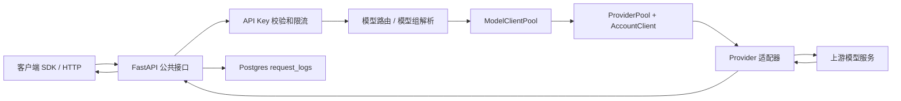
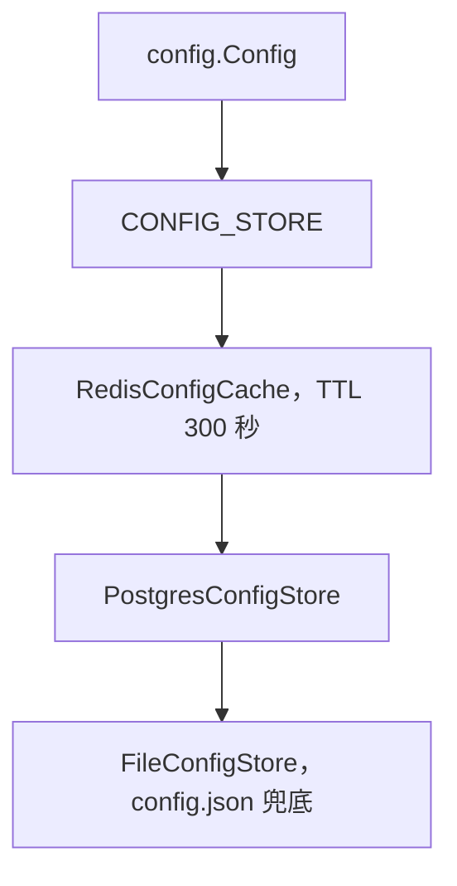

# Ai Lubricant 系统架构

最后更新：2026-05-22

## 1. 系统概览

本项目是一个基于 Python FastAPI 的多模型代理服务。它对外提供 OpenAI 兼容接口和 Anthropic 兼容接口，对内通过多个 Provider 适配器转发到不同上游渠道，并负责账号池、模型路由、失败重试、用量统计、请求日志、后台清理和管理端配置。

核心入口：

- `main.py`：FastAPI 应用、公共 API 路由、生命周期、请求校验、重试、用量统计和请求日志。
- `admin.py`：`/admin` 管理 API 和 `static/admin.html` 管理页面。
- `providers/`：上游渠道适配层。所有渠道继承 `providers/base.py::BaseProvider`。
- `rate_limiter.py`：API Key 限流、账号池、ProviderPool、模型注册、路由决策和定时任务。
- `config.py`、`config_store.py`：配置读取门面和配置存储层，支持文件兜底、Postgres 持久化和 Redis 缓存。
- `db.py`：Postgres 表结构创建和所有数据库读写方法。
- `rd.py`：Redis 客户端包装和连接初始化。

整体请求链路：



## 2. 启动流程

`main.py::lifespan` 负责应用启动和关闭。

启动时执行：

1. `PostgresClient.init()` 初始化 Postgres 连接池并建表。
2. `Config.initialize_store()` 初始化配置存储。
3. `JdbcClient.ping()` 初始化 Redis。
4. 向 `ModelClientPool` 注册内置 Provider。
5. 从配置中识别自定义 Provider 并注册为 `CustomProvider`。
6. 将启用的渠道账号加入对应 ProviderPool。
7. 异步启动 `ModelClientPool.initialize()`。

关闭时执行：

- `ModelClientPool.stop()` 取消定时任务。
- `PostgresClient.close()` 关闭数据库连接池。

## 3. 公共 API

公共 API 主要在 `main.py` 中。

| 路由 | 兼容协议 | 用途 |
| --- | --- | --- |
| `GET /v1/models`、`GET /models` | OpenAI | 返回 OpenAI 格式模型列表。 |
| `POST /v1/chat/completions`、`POST /chat/completions` | OpenAI | Chat Completions，支持流式和非流式。 |
| `POST /v1/messages`、`POST /messages` | Anthropic | Anthropic Messages 兼容接口，内部转 OpenAI 消息格式处理。 |
| `GET /v1/dashboard/billing/usage`、`GET /dashboard/billing/usage` | OpenAI-like | 从请求日志中统计用量。 |
| `POST /v1/token/count`、`POST /token/count` | 工具接口 | 根据消息字符数估算 Token。 |
| `POST /v1/images/generations`、`POST /images/generations` | OpenAI Images | 转发到支持 `generate_image` 的渠道。 |

鉴权逻辑：

- 当 `config.Config.api_keys_enabled()` 为 false 时，API Key 可不启用。
- OpenAI 路由使用 `Authorization: Bearer <key>`。
- Anthropic 路由额外支持 `x-api-key`。
- `RateLimiter.acquire()` 校验 API Key 的 RPM/RPD。Redis 可用时使用 Redis 有序集合，否则使用内存计数。

## 4. 管理端 API

`admin.py` 使用 `APIRouter(prefix="/admin")`。

主要接口组：

- 登录会话：`/admin/login`、`/admin/logout`、`/admin/check-auth`、`/admin/change-password`。
- 主配置：`/admin/config/main`、server、logging、model-refresh、message-delete、postgres、redis、retry、system、log-retention。
- API Key：查询、启停、新增、修改、删除、使用量。
- 模型路由：`/admin/model-routing`。
- 渠道管理：渠道列表、基础配置、原始配置、启停、重试次数、模型别名、白名单、刷新模型、上游模型、健康检查。
- 自定义渠道：创建自定义渠道、抓取模型、更新自定义渠道配置。
- 账号管理：新增、修改、删除、启停、测试、初始化、检查账号、账号每日用量。
- 代理配置：`/admin/config/proxies`。
- 日志和统计：最近日志、请求日志列表和详情、仪表盘统计、总体统计。

管理端 Session：

- 登录后生成 token。
- Redis 可用时存储在 `admin:session:{token}`。
- Redis 不可用时使用进程内 `_admin_sessions_mem` 兜底。

## 5. Provider 架构

所有渠道继承 `providers/base.py::BaseProvider`。

必须实现的契约：

- `init_auth(is_check=False) -> bool`：初始化或检查认证。
- `check_auth() -> bool`：检查凭据是否有效。
- `fetch_model_list() -> list[dict]`：返回对外模型列表。
- `_do_stream_chat(model_id, messages, **kwargs)`：渠道自己的流式聊天实现。
- `_do_non_stream_chat(model_id, messages, **kwargs)`：渠道自己的非流式聊天实现。

可选能力：

- `fetch_upstream_model_list()`：管理端查看完整上游模型。
- `clear_conversations(max_age_hours)`：清理上游 Web 会话。
- `generate_image`、`generate_video`、`synthesize_speech`：多媒体能力。
- `check_message`、`record_message`：渠道级配额检查。
- `update_quota_from_headers`：从上游响应头同步配额。

`BaseProvider.chat()` 负责统一输出格式：

- 生成 OpenAI 流式 role chunk。
- 处理 content、reasoning/thinking、tool_calls。
- 修复和解析文本形式的工具调用。
- 生成 usage chunk。
- 输出结束 chunk 和 `data: [DONE]`。
- 非流式时返回 OpenAI 格式完整响应。

## 6. 内置渠道

> CLI 逆向渠道（copilot/codebuddy/atomcode/eaichat/qoder）已下架为「代码渠道」形态：
> 产品只发框架能力，spec 源码由使用者自行粘贴进管理端「源码」Tab 与分发。
> 保留的内置渠道仅剩走官方公开 API 的 Cloudflare / EdgeOne。

| Provider | 类 | 上游形式 | 说明 |
| --- | --- | --- | --- |
| `cloudflare` | `CloudflareProvider` | Cloudflare Workers AI | 官方公开 API，需 Account ID + API Token。 |
| `edgeone-ai` | `EdgeOneAIProvider` | EdgeOne AI | 官方公开 API，二级域名 + 模型名定位上游。 |
| `custom` | `CustomProvider` | 可配置 OpenAI/Anthropic API | 可配置 base URL、路径、协议、请求头、模型抓取、健康检查、余额检查。 |
| `code` | 代码渠道适配器 | 用户贴的 spec 类 | 见 [代码渠道](./providers/code-channel.md)：贴一个普通类 + `@staticmethod` 钩子即造一个完整渠道。 |

自定义渠道常见配置：

- `base_url`
- `chat_path`
- `models_path`
- `protocol`
- 认证头或自定义请求头
- `model_aliases`
- `model_whitelist`
- 健康检查和余额检查
- `accounts`

## 7. 支持协议和行为

对外协议：

- OpenAI Chat Completions：`/v1/chat/completions`。
- OpenAI Models：`/v1/models`。
- OpenAI Images：`/v1/images/generations`。
- Anthropic Messages：`/v1/messages`。
- Token 估算和用量统计辅助接口。

内部消息格式：

- 内部统一偏向 OpenAI `messages`。
- Anthropic 请求由 `message_utils.anthropic_to_openai_messages` 转为 OpenAI 格式。
- Anthropic 响应由 `message_utils.openai_to_anthropic_response` 或 `convert_stream_to_anthropic` 转回。

流式输出：

- OpenAI 路由返回 SSE：`data: {json}`，最后 `data: [DONE]`。
- Anthropic 流式响应由内部 OpenAI 流转换成 Anthropic SSE 事件。

工具调用：

- 接收 OpenAI `tools`。
- 支持原生工具调用的渠道可以直接转发或适配。
- 不支持原生工具调用的渠道可通过 `tool_utils.generate_tools_prompt()` 注入 XML 工具调用提示。
- `tool_utils.parse_tool_calls_from_content()` 支持从 XML 或 fenced `tool_call` JSON 中解析工具调用。

思考和推理：

- 支持 `reasoning_effort`、`thinking_enabled`、`thinking_mode`、`thinking_budget`、`thinking_format`、`auto_search`、`research_mode` 等参数。
- `message_utils` 中有对 Qwen 和旧 thinking 参数的归一化工具。

## 8. 路由、重试和账号选择

`ModelClientPool` 维护全局路由状态：

- `_provider_pools`：Provider 名称到 ProviderPool。
- `_models`：OpenAI 格式模型列表。
- `_model_providers`：模型 ID 到可用 Provider 列表。
- `_channel_scores`：自定义渠道的延迟评分。
- `_model_provider_quota`：模型和 Provider 维度的配额快照。

路由来源优先级：

1. 主配置中的 `model_routes`，可按 API Key 作用域匹配。
2. 主配置中的 `model_groups`，把一个请求模型名展开成多个真实模型。
3. 根据模型当前可用 Provider 智能选择。

账号选择考虑因素：

- Provider 是否启用。
- 账号 `switch` 是否打开。
- 渠道认证是否初始化。
- 429 后的冷却时间。
- RPM、TPM 和并发限制。
- 上游返回的配额。
- 模型级 TPM 限制。
- 账号 `priority` 和 `weight`。
- 自定义渠道延迟评分。

重试逻辑：

- `_chat_with_retry` 使用 Provider 自身 `retry_count` 或全局 `retry.max_retries`。
- HTTP 429 会切换账号，并对失败账号设置冷却。
- retry path 会记录 provider、account、routed model、状态、错误、首 token 时间、上游响应头和部分请求/响应体。

## 9. 配置和存储

配置门面：

- `config.Config` 缓存主配置和 Provider 配置。
- 主配置初始来自 `config.json`，运行时优先走 Postgres/Redis。
- Provider 配置默认存储在 Postgres 的 provider 表中，而不是只依赖 `config/*.json`。

配置存储链路：



重要主配置：

- `postgres`：数据库连接。
- `redis`：Redis 前缀、地址、DB、连接数。
- `server`：服务监听地址和端口。
- `api_keys`：是否启用 API Key；具体 Key 存在 Postgres。
- `model_routes`：显式模型路由。
- `model_groups`：模型组。
- `model_refresh`：模型列表刷新开关和间隔。
- `message_delete`：历史会话清理开关和间隔。
- `logging`：日志级别。
- `system`：debug 开关。
- `data_retention`：响应体和日志保留时间。

Provider 配置字段：

- `enabled`
- `rate_limit`
- `retry_count`
- `clear_conversation`
- `model_aliases`
- `model_whitelist`
- 渠道专属字段
- `accounts`

数据库表：

- `app_config`：主配置 JSON。
- `provider_configs`：Provider 基础配置。
- `provider_accounts`：Provider 账号。
- `request_logs`：请求、响应、重试和用量日志。
- `api_keys`：API Key 和限流配置。
- `operation_logs`：管理端操作审计。

Redis 用途：

- 管理端 Session。
- API Key 和账号 RPM/TPM 窗口。
- 配置缓存。
- 部分渠道的认证、配额或运行态缓存。

## 10. 定时任务

后台任务由 `ModelClientPool.initialize()` 启动。

| 任务 | 方法 | 频率 | 配置 | 用途 |
| --- | --- | --- | --- | --- |
| 账号健康检查 | `check_account_loop` | 每 30 分钟 | 固定 | 检查账号认证状态。 |
| 模型列表刷新 | `refresh_models_loop` | `model_refresh.interval_minutes` | `model_refresh.enabled` | 重建模型注册表。 |
| 会话清理 | `delete_message_loop` | `message_delete.interval_minutes` | `message_delete.enabled` | 调用各 Provider 的 `clear_conversations`。 |
| 响应和日志清理 | `clean_response_loop` | 每小时检查，本地时间 2 点执行一次 | `data_retention` | 清理旧响应体和旧成功日志。 |

启动时还会执行：

- 初始化所有账号。
- 首次刷新模型列表。
- 立即执行一次会话清理。

## 11. 日志和可观测性

请求日志通过 `PostgresClient.insert_request_log` 写入。

记录字段包括：

- request ID 和 parent request ID。
- API Key 和 API Key 名称。
- Provider 和账号。
- 请求模型和接口。
- 是否流式、是否成功、状态、耗时、首 token 时间。
- prompt/completion/total/cached token。
- 请求体和脱敏请求头。
- 上游请求体、上游响应片段和脱敏响应头。
- retry path。
- 错误信息。

管理端可查询：

- 最近内存日志。
- 持久化请求日志。
- 请求详情。
- 仪表盘统计。
- 账单/用量统计。
- Token 统计。
- 账号每日用量。

敏感请求头由 `main._sanitize_headers` 脱敏。

## 12. 辅助模块

- `message_utils.py`：OpenAI/Anthropic 转换、SSE 解析和生成、ID 生成、reasoning 参数处理。
- `tool_utils.py`：工具提示词生成、工具调用解析、工具消息构造。
- `model_metadata.py` 和 `model_metadata.json`：模型元数据默认值和能力补全。
- `notice.py`：外部通知发送。
- `init_db.py`：数据库初始化入口。
- `test_api.py` 和 `script/test_openai*.py`：手工或 smoke 测试脚本。
- `wispbyte/`：独立的 Playwright/CDP 遥测探索脚本和静态页面，不属于模型 API 主请求链路。

## 13. 目录速查

```text
.
|-- main.py                  # FastAPI 应用和公共 API
|-- admin.py                 # 管理端 API 和管理页面入口
|-- config.py                # 配置读取门面
|-- config_store.py          # 文件 / Postgres / Redis 配置存储
|-- db.py                    # Postgres 表结构和持久化方法
|-- rd.py                    # Redis 包装
|-- rate_limiter.py          # 限流、账号池、模型注册、路由、定时任务
|-- message_utils.py         # 协议转换和 SSE 辅助
|-- tool_utils.py            # 工具提示词和工具调用解析
|-- model_metadata.py        # 模型元数据加载
|-- providers/
|   |-- base.py              # Provider 契约和统一 chat 输出
|   |-- custom.py            # 可配置 OpenAI/Anthropic 渠道
|   |-- code_spec.py         # 代码渠道 spec 适配器（普通类 + @staticmethod 钩子）
|   |-- code_loader.py       # 代码渠道源码 exec 与缓存
|   |-- qwen.py
|   |-- xiaomi.py
|   |-- jiekou.py
|   |-- puter.py
|   |-- gemini.py
|   `-- tabbit.py
|-- config/                  # 旧式或示例 Provider JSON
|-- static/admin.html        # 管理页面
|-- docs/                    # 长期项目文档
|-- plans/                   # 有状态计划
|-- sql/init.sql             # 数据库建表和迁移 SQL
|-- script/                  # 手工工具和测试脚本
`-- wispbyte/                # 独立 CDP/遥测探索资产
```
